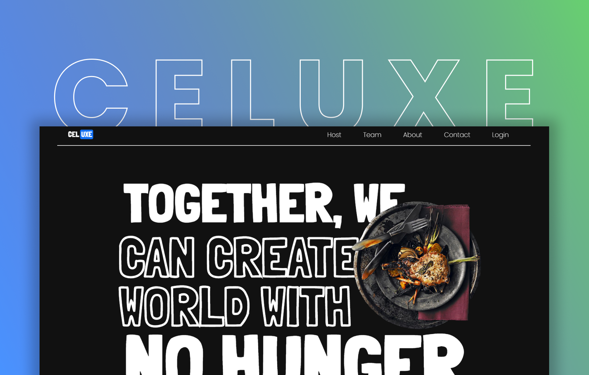

<h1 align="center">Celuxe</h1>

## Inspiration
1. We believe this hackathon is a great opportunity for our career-boost. It also is a great learning point to pitch new ideas, learn, improve our present skills and find the right approach to make this project successful.
2. The theme is both exciting and challenging. Food insecurity is often associated with poor mental health outcomes. There's a link between poor nutrition and poor mental health outcomes. This is often associated with poor academics and affects on social relationships and engagement in extra curricular activities. The association between food insecurity and depression is also very significant.
3. To attract students globally, building a good UI is also necessary. We have focused on this aspect and have implemented a professional and simple UI 
## What it does
Celuxe offers a wide options for the students to avail the resources. It increases SNAP enrollment for eligible students based on the income of household, improves accessibility of nutritious food on campus, raises awareness of the existing campus resources, and many more.
## How we built it
We started off by planning and customizing the UI design and what major things to include. Then we proceeded to build the backend, deal with database then tested and finalized. To make this project, we used many tech stacks and APIs. Some of them include - React, NodeJS, ExpressJS, Auth0, MongoDB, GraphQL, Mongoose, etc.
## Challenges we ran into
We faced some issues while dealing with git version control and deployment of the application when we tried pushing multiple commits but later we could figure that out.
## Accomplishments that we're proud of
We could successfully implement new features we learnt for this hackathon like GraphQL and could test out some others successfully.
## What we learned
We learned about some APIs. Most importantly, this hackathon taught us how to work and contribute together and accomplish more together, some troubleshooting methodologies and engaging with different tech stacks.
## What's next for Celuxe
We are planning to implement Twilio and Google Maps API.

### Contributors

- [Suvangi Paul](https://github.com/suvangipaul)
- [Barat Nikhita](https://github.com/nikhitaBarat/)
- [Siddhant Prateek](https://github.com/siddhantprateek)
